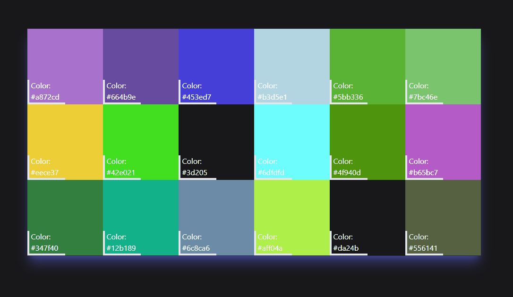

# Color Palette App

Click on the tile and get some new color ideas along with the color code;

 

 

## Table of Contents
- [Installation](#installation)
- [Usage](#usage)
- [Credits](#credits)
- [License](#license)
- [Collaborators](#Collaborators)

## Installation
Current project has been saved in my personal GitHub repository and is currently available for cloning and reviews on:

https://github.com/Valllerian/Pig-Game-App

## Usage

Access the deployed app on: 

https://valllerian.github.io/Pig-Game-App/

## Credits

Talwind instalation guide: 

 

https://tailwindcss.com/docs/guides/create-react-app

## License
Current project is unlicensed. Which means - "Anyone is free to copy, modify, publish, use, compile, sell, or
distribute this software, either in source code form or as a compiled
binary, for any purpose, commercial or non-commercial, and by any
means." (Quote for source #3)

## Collaborators:

Valerii Bihun: valeriibihun.co@gmail.com;
